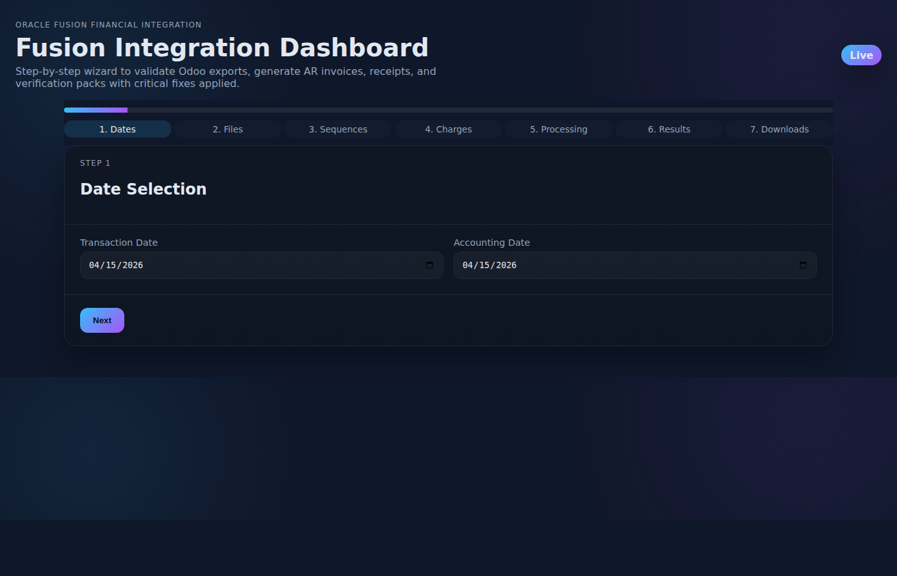

# Fusion Integration Dashboard

This project provides a production-ready Flask web application to generate Oracle Fusion AR Invoices and Receipts from Odoo/Vend exports with all specified critical fixes applied.

## Quick start

```bash
python -m venv .venv
source .venv/bin/activate
pip install -r requirements.txt
python app.py
```

Then open http://localhost:5000 to use the wizard.

## Features
- 7-step wizard with validation for all four required source files.
- Forward-fill payment order refs and branch before aggregation.
- BNPL-aware sequence generation with overflow guards.
- Bank-charge and cash-rounding miss receipts with cap logic and verification report.
- Downloadable AR invoices, standard receipts, miss receipts, and full bundle (UTF-8 BOM, quoted fields).

## Frontend wizard preview


